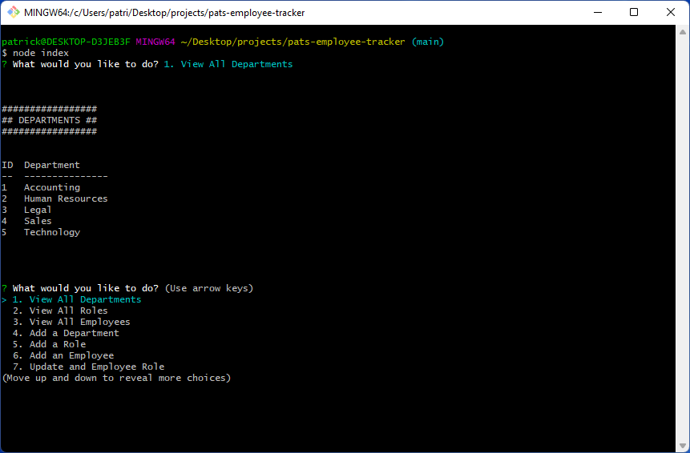

# Pat's Employee Tracker

## Description

  - An employee database and front end you can use to manage departments, roles and employees.
  - Databases are very important to businesses and potential employers and I was motivated to demonstrate my ability to use SQL to create a database and to build a front end to easily manage the data.
  - I wanted to learn how to use the MySQL2 package because it will be used for other projects and in my pprofessional career.
  - This project gives you a low maintenance and easy to use interface to manage a database.
  - I learned how to use MySQL to do Create, Read, Update and Delete operations on any table. I also learned how to use the MySQL2 packate in node to easily work with the database from my code.

## Table of Contents

  - [Installation](#installation)
  - [Usage](#usage)
  - [License](#license)
  - [Contributing](#contributing)
  
  - [Questions](#questions)

## Installation

  - git clone https://github.com/patrickaregan/pats-employee-tracker.git

## Usage

  - In the root directory run "npm i" to install dependencies, then run "node index"

  
  - [Watch a demo video](https://drive.google.com/file/d/1XD-FgAoh8MWD3IE57UQ7NlbLuZln1Bwm/view)

## License

  - MIT

## Contributing

  - My contribution rule is to treat others with respect and if you see any violations please contact me at my email below.  
  

## Questions

- [GitHub Profile](https://github.com/patrickaregan)
- If you have additional questions please email me at patrickaregan@gmail.com

